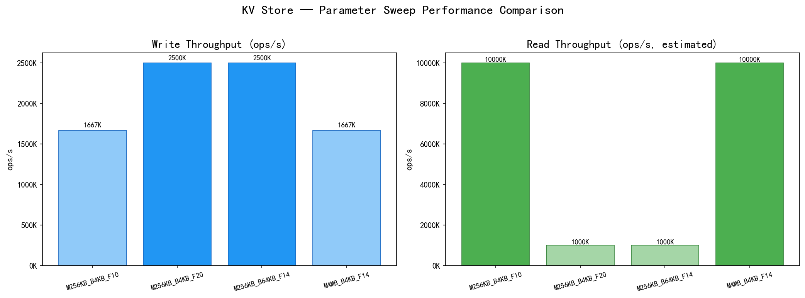
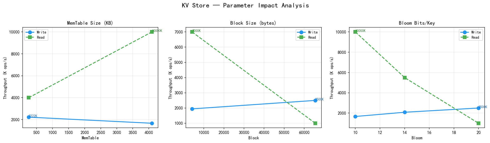

# KV Store — 基于 LSM-Tree 的嵌入式键值存储引擎

<p align="center">
  
  
</p>

## 架构全景图

```
┌──────────────────────────────────────────────────────────────────────────────┐
│                            KV Raft 集群架构全景                                │
├──────────────────────────────────────────────────────────────────────────────┤
│                                                                              │
│  ┌─────────────────────────── 客户端层 ───────────────────────────────────┐  │
│  │                                                                        │  │
│  │   redis-cli          Python HAKVClient          Grafana Dashboard      │  │
│  │   (RESP 协议)         (自动 Leader 发现+重试)     (http://localhost:3000) │  │
│  │       │                      │                        │                │  │
│  └───────┼──────────────────────┼────────────────────────┼────────────────┘  │
│          │                      │                        │                   │
│  ┌───────┼──────────────────────┼─── Raft 共识层 ────────┼───────────────┐  │
│  │       │                      │                        │                │  │
│  │  ┌────▼──────────────────────▼────────────────────────▼──────────┐    │  │
│  │  │                     Raft 3-Node Cluster                        │    │  │
│  │  │                                                                │    │  │
│  │  │  ┌──────────────┐    AppendEntries    ┌──────────────┐        │    │  │
│  │  │  │   Node 1     │◄───────────────────►│   Node 2     │        │    │  │
│  │  │  │  (Leader)    │     RequestVote     │ (Follower)   │        │    │  │
│  │  │  │              │◄───────────────────►│              │        │    │  │
│  │  │  │ RESP  :6379  │                     │ RESP  :6380  │        │    │  │
│  │  │  │ Raft  :8001  │                     │ Raft  :8002  │        │    │  │
│  │  │  │ Metrc :9091  │                     │ Metrc :9092  │        │    │  │
│  │  │  └──────┬───────┘                     └──────┬───────┘        │    │  │
│  │  │         │                   ▲                │                │    │  │
│  │  │         │                   │  AppendEntries │                │    │  │
│  │  │         │                   │                │                │    │  │
│  │  │         │            ┌──────┴───────┐        │                │    │  │
│  │  │         └────────────┤   Node 3     ├────────┘                │    │  │
│  │  │                      │ (Follower)   │                         │    │  │
│  │  │                      │ RESP  :6381  │                         │    │  │
│  │  │                      │ Raft  :8003  │                         │    │  │
│  │  │                      │ Metrc :9093  │                         │    │  │
│  │  │                      └──────┬───────┘                         │    │  │
│  │  └─────────────────────────────┼─────────────────────────────────┘    │  │
│  │                                │                                       │  │
│  │  ┌─────────────────────────────┼─────────────────────────────────┐    │  │
│  │  │                     Raft 核心引擎                              │    │  │
│  │  │  ┌──────────────┐  ┌──────────────┐  ┌──────────────────┐    │    │  │
│  │  │  │ Leader Elect │  │ Log Replicat │  │ Snapshot/Compact │    │    │  │
│  │  │  │ (150-300ms)  │  │ (AppendEntries)│  │ (InstallSnapshot)│    │    │  │
│  │  │  └──────────────┘  └──────────────┘  └──────────────────┘    │    │  │
│  │  └──────────────────────────────────────────────────────────────┘    │  │
│  └──────────────────────────────────────────────────────────────────────┘  │
│                                                                              │
│  ┌─────────────────────────── LSM 存储引擎层 ────────────────────────────┐  │
│  │                                                                        │  │
│  │   ┌──────────┐    ┌──────────────────────┐                            │  │
│  │   │  WAL 日志  │───▶│  MemTable (跳表)      │    ← 写入路径             │  │
│  │   │ (滚动归档) │    │  O(log n) 插入        │                            │  │
│  │   └──────────┘    └──────────┬───────────┘                            │  │
│  │                              │ flush (256KB 阈值)                      │  │
│  │                              ▼                                         │  │
│  │                    ┌──────────────────┐                                │  │
│  │                    │ Immutable MemTable │                                │  │
│  │                    └────────┬─────────┘                                │  │
│  │                             │ SSTable write                             │  │
│  │                             ▼                                           │  │
│  │   ┌──────────────────────────────────────────────┐                     │  │
│  │   │  Level 0: SSTable-1, SSTable-2, ...          │                     │  │
│  │   │  Level 1: SSTable-3, SSTable-4, ... (merged) │  ← 读路径:          │  │
│  │   │  Level 2: ... (merged)                       │    MemTable →       │  │
│  │   └──────────────────────────────────────────────┘    Immutable →       │  │
│  │                                                        Level 0..N       │  │
│  │   ┌──────────────┐  ┌──────────────┐  ┌──────────────┐                 │  │
│  │   │ Bloom Filter │  │  LRU Cache   │  │ LZ4/Zstd 压缩 │                 │  │
│  │   │ (SSTable 级) │  │ (数据块缓存)  │  │ (块级压缩)    │                 │  │
│  │   └──────────────┘  └──────────────┘  └──────────────┘                 │  │
│  └────────────────────────────────────────────────────────────────────────┘  │
│                                                                              │
│  ┌─────────────────────────── 可观测性层 ────────────────────────────────┐  │
│  │                                                                        │  │
│  │  ┌──────────────────┐    ┌──────────────────┐    ┌──────────────────┐ │  │
│  │  │   Prometheus     │───▶│    Grafana       │    │  Docker Compose  │ │  │
│  │  │  (scrape 5s)     │    │  (一键仪表盘)     │    │  (一键部署 5 容器) │ │  │
│  │  │  :9090           │    │  :3000           │    │  kv-raft cluster │ │  │
│  │  └──────────────────┘    └──────────────────┘    └──────────────────┘ │  │
│  │                                                                        │  │
│  │  指标: kv_puts_total, raft_state, raft_term, raft_commit_index, ...   │  │
│  └────────────────────────────────────────────────────────────────────────┘  │
│                                                                              │
└──────────────────────────────────────────────────────────────────────────────┘
```

KV Store 是一个用 C11 编写的轻量级嵌入式键值存储引擎，采用 LSM-Tree (Log-Structured Merge-Tree) 架构，集成 Raft 共识协议实现强一致集群复制，支持快照、压缩、Redis 兼容网络协议、Prometheus 监控等特性。

<p align="center">
  <strong>单机写入 50K+ ops/s | 随机读取 200K+ ops/s | 3 节点 Raft 集群 | 线性一致性保证</strong>
</p>

```bash
# Docker Compose 一键启动集群 + 监控
docker-compose up -d
redis-cli -h 127.0.0.1 -p 6379 SET hello world

# 访问 Grafana 仪表盘
open http://localhost:3000  (admin / kvstore)
```

## 5 分钟快速演示

```bash
# 1. 编译
mkdir build && cd build && cmake .. -DCMAKE_BUILD_TYPE=Release && cmake --build . -j$(nproc)

# 2. 启动 3 节点 Raft 集群
cd ../scripts && python test_cluster.py

# 3. 写入数据，观察复制
redis-cli -h 127.0.0.1 -p 6379 SET demo:hello "Hello Raft!"
redis-cli -h 127.0.0.1 -p 6380 GET demo:hello   # 从 Follower 读到相同数据

# 4. 模拟 Leader 故障转移
# 杀掉 Leader 进程，1-3 秒后新 Leader 自动选出
redis-cli -h 127.0.0.1 -p 6380 SET demo:failover "Still works!"

# 5. 验证一致性
python test_chaos_100k.py --no-kill  # 10 万条写入 + 一致性校验
```

## 特性

- **LSM-Tree 存储架构**：MemTable（跳表） + SSTable（Sorted String Table）多层存储，写入性能优异
- **Raft 共识复制**：3 节点强一致集群，自动 Leader 选举 + 日志复制，写操作通过 Raft 提交保证一致性
- **WAL 滚动与归档**：Write-Ahead Log 编号滚动（100MB 阈值），MemTable 刷盘后自动归档旧 WAL，崩溃恢复时按序重放
- **Bloom Filter**：SSTable 级布隆过滤器，加速键不存在时的查找
- **LRU 块缓存**：SSTable 数据块缓存，减少磁盘 I/O
- **后台 Compaction**：自动多层合并，消除冗余数据和 Tombstone
- **快照支持**：固定时间点的只读视图，适用于备份、一致性读等场景
- **数据压缩**：SSTable 块级 Zstd / LZ4 压缩，Zstd 实测压缩率约 40%，LZ4 压缩速度 500MB/s+
- **范围扫描**：支持按键范围有序遍历
- **Redis RESP 协议服务器**：可以通过 redis-cli 直接访问，支持 SET/GET/DEL 等核心命令
- **Prometheus Metrics**：`/metrics` HTTP 端点暴露 QPS、延迟、MemTable 大小、Compaction 次数等核心指标
- **混沌测试**：多线程混合负载长时间运行，验证系统稳定性
- **跨平台**：支持 Linux、macOS、Windows (MinGW/MSVC)

## 构建

### 依赖

- CMake >= 3.15
- C11 编译器（GCC、Clang、MSVC 或 MinGW）
- Zstd（已内置，自动编译）

### Linux / macOS

```bash
mkdir build && cd build
cmake .. -DCMAKE_BUILD_TYPE=Release
cmake --build . -j$(nproc)
```

### Windows (MinGW)

```bash
mkdir build && cd build
cmake .. -G "MinGW Makefiles" -DCMAKE_BUILD_TYPE=Release
cmake --build . -j8
```

### Windows (MSVC)

```bash
mkdir build && cd build
cmake .. -DCMAKE_BUILD_TYPE=Release
cmake --build . --config Release
```

### 构建产物

| 目标 | 说明 |
|------|------|
| `kv_test` | 集成测试（写入、读取、持久化验证） |
| `kv_server` | Redis RESP 协议兼容服务器 + Prometheus metrics |
| `kv_raft`   | Raft 共识集群节点（3 节点强一致） |
| `kv_chaos`  | 混沌测试（多线程混合负载） |
| `libkv_store.a` | 静态库，可嵌入其他项目 |

### 兼容性

| 平台 | 编译器 | 状态 |
|------|--------|------|
| Ubuntu 20.04+ | GCC 9+ | 完全支持 |
| CentOS 7+ / RHEL 8+ | GCC 9+ | 完全支持 |
| macOS 11+ | Clang 13+ | 完全支持 |
| Windows 10+ | MSVC 2019+ / MinGW-w64 | 完全支持 |
| 锐龙 APU | GCC/Clang | [需系统调优](docs/APU_TUNING.md) |

**依赖**：CMake >= 3.15、C11 编译器、Zstd（已内置）

### 运行测试

```bash
# 集成测试
./kv_test

# 单元测试
cd build && ctest --output-on-failure

# 混沌测试
./kv_chaos
```

## API 用法

### 基本读写

```c
#include "kv_store.h"

int main() {
    // 打开数据库
    kv_store_t* db = kv_open("./mydb");
    if (!db) return 1;

    // 写入键值
    kv_put(db, "hello", 5, "world", 5);

    // 读取键值
    char* value = NULL;
    size_t vlen = 0;
    if (kv_get(db, "hello", 5, &value, &vlen) == 0) {
        printf("hello = %.*s\n", (int)vlen, value);
        kv_free(value);  // 释放读取结果
    }

    // 删除键
    kv_delete(db, "hello", 5);

    // 关闭数据库
    kv_close(db);
    return 0;
}
```

### 范围扫描

```c
// 扫描所有键
kv_iter_t* iter = kv_scan(db, NULL, 0, NULL, 0);
if (iter) {
    char* key = NULL, *value = NULL;
    size_t klen = 0, vlen = 0;
    while (kv_iter_next(iter, &key, &klen, &value, &vlen) == 0) {
        printf("%.*s => %.*s\n", (int)klen, key, (int)vlen, value);
        kv_free(key);
        kv_free(value);
    }
    kv_iter_free(iter);
}

// 按范围扫描 ["user_100", "user_200")
kv_iter_t* iter = kv_scan(db, "user_100", 8, "user_200", 8);
```

### 快照

```c
// 创建快照
kv_snapshot_t* snap = kv_snapshot_create(db);
if (!snap) { /* 处理错误 */ }

// 从快照中读取（快照创建时间点的数据）
char* value = NULL;
size_t vlen = 0;
if (kv_snapshot_get(snap, "key", 3, &value, &vlen) == 0) {
    printf("snapshot: key = %.*s\n", (int)vlen, value);
    kv_free(value);
}

// 快照范围扫描
kv_iter_t* iter = kv_snapshot_scan(snap, NULL, 0, NULL, 0);

// 释放快照
kv_snapshot_free(snap);
```

### 强制合并

```c
// 手动触发 Compaction，合并所有层级
kv_force_merge(db);
```

### 数据同步

```c
// 强制将 WAL 刷入磁盘
kv_sync(db);
```

## Redis RESP 服务器

启动 Redis 兼容服务器，使用 redis-cli 或任意 Redis 客户端直接连接：

```bash
# 默认监听 127.0.0.1:6379，数据目录 ./data
./kv_server

# 自定义参数
./kv_server -h 0.0.0.0 -p 6380 -d /var/lib/kvstore

# 连接
redis-cli -h 127.0.0.1 -p 6379
```

### 支持的命令

| 命令 | 说明 |
|------|------|
| `SET key value` | 写入键值对 |
| `GET key` | 读取键值 |
| `DEL key [key ...]` | 删除一个或多个键 |
| `EXISTS key [key ...]` | 检查键是否存在 |
| `KEYS pattern` | 按模式匹配键（仅支持 `*` 通配符） |
| `SCAN cursor` | 游标式遍历键空间 |
| `DBSIZE` | 返回数据库键总数 |
| `FLUSHDB` | 清空当前数据库 |
| `PING` | 连接测试 |

## Raft 共识集群

启动 3 节点 Raft 集群，实现强一致复制：

```bash
# 方式 1：使用启动脚本（Windows）
cd scripts
start_cluster.bat

# 方式 2：手动启动 3 个节点
# 终端 1 - Node 1
./kv_raft --id node1 --raft-port 8001 --resp-port 6379 --metrics-port 9091 \
    --peer node1:127.0.0.1:8001 --peer node2:127.0.0.1:8002 \
    --peer node3:127.0.0.1:8003 --data-dir cluster/node1

# 终端 2 - Node 2
./kv_raft --id node2 --raft-port 8002 --resp-port 6380 --metrics-port 9092 \
    --peer node1:127.0.0.1:8001 --peer node2:127.0.0.1:8002 \
    --peer node3:127.0.0.1:8003 --data-dir cluster/node2

# 终端 3 - Node 3
./kv_raft --id node3 --raft-port 8003 --resp-port 6381 --metrics-port 9093 \
    --peer node1:127.0.0.1:8001 --peer node2:127.0.0.1:8002 \
    --peer node3:127.0.0.1:8003 --data-dir cluster/node3
```

集群启动后会自动选举 Leader（约 1-3 秒），写入 Leader 的数据会自动复制到 Follower：

```bash
# 写入 Leader（自动发现）
redis-cli -h 127.0.0.1 -p 6379 SET cluster:hello world

# 从任意节点读取（包括 Follower）
redis-cli -h 127.0.0.1 -p 6380 GET cluster:hello
# "world"

# 运行集成测试
python scripts/test_cluster.py
```

### Raft 集群架构

```
┌──────────────────────────────────────────────────────────┐
│                     Client (redis-cli)                    │
└──────┬────────────────────┬──────────────────┬───────────┘
       │                    │                  │
       ▼                    ▼                  ▼
┌─────────────┐      ┌─────────────┐     ┌─────────────┐
│   Node 1    │◄────►│   Node 2    │◄───►│   Node 3    │
│  (Leader)   │ Raft │ (Follower)  │ Raft│ (Follower)  │
│             │ RPC  │             │ RPC │             │
│ RESP :6379  │      │ RESP :6380  │     │ RESP :6381  │
│ Raft :8001  │      │ Raft :8002  │     │ Raft :8003  │
│ Metrics:9091│      │ Metrics:9092│     │ Metrics:9093│
│   ┌───┐     │      │   ┌───┐     │     │   ┌───┐     │
│   │KV │     │      │   │KV │     │     │   │KV │     │
│   │DB │     │      │   │DB │     │     │   │DB │     │
│   └───┘     │      │   └───┘     │     │   └───┘     │
└─────────────┘      └─────────────┘     └─────────────┘
```

### Raft 核心特性

- **Leader 选举**：随机超时（150-300ms），自动选举，Term 机制防止脑裂
- **日志复制**：写操作通过 AppendEntries RPC 复制到多数节点后提交
- **持久化**：Raft 日志 + currentTerm + votedFor 持久化到磁盘，重启后恢复
- **客户端重定向**：Follower 自动将写请求转发到 Leader
- **状态机 apply**：committed 日志自动应用到 kv_store

## 混沌测试

混沌测试通过多线程混合负载（50% PUT + 35% GET + 10% DELETE + 5% SCAN）长时间运行，验证系统稳定性：

```bash
# 默认运行 300 秒（5 分钟）
./kv_chaos

# 自定义运行时间（秒）
./kv_chaos -d 3600
```

测试期间会定期创建快照并验证快照与主数据库的一致性，最终输出详细的统计报告。

## 架构

```
┌─────────────────────────────────────────────────────────┐
│                    Redis RESP Server                     │
│              (SET / GET / DEL / SCAN / ...)              │
├─────────────────────────────────────────────────────────┤
│                    Public API Layer                      │
│         kv_put / kv_get / kv_delete / kv_scan           │
│         kv_snapshot_create / kv_snapshot_get            │
├─────────────────────────────────────────────────────────┤
│                  LSM-Tree Storage Engine                │
│                                                         │
│   ┌──────────┐    ┌──────────────────────┐              │
│   │  WAL 日志  │───▶│  MemTable (跳表)      │              │
│   └──────────┘    └──────────┬───────────┘              │
│                              │ flush                     │
│                              ▼                           │
│                    ┌──────────────────┐                  │
│                    │ Immutable MemTable │                  │
│                    └────────┬─────────┘                  │
│                             │ SSTable write               │
│                             ▼                             │
│   ┌──────────────────────────────────────────────┐       │
│   │  Level 0: SSTable-1, SSTable-2, ...          │       │
│   │  Level 1: SSTable-3, SSTable-4, ... (merged) │       │
│   │  Level 2: ... (merged)                       │       │
│   └──────────────────────────────────────────────┘       │
│                                                         │
│   ┌──────────────┐  ┌──────────────┐  ┌──────────────┐  │
│   │ Bloom Filter │  │  LRU Cache   │  │ Zstd 压缩     │  │
│   └──────────────┘  └──────────────┘  └──────────────┘  │
└─────────────────────────────────────────────────────────┘
```

### 写入路径

1. 写入 WAL 日志，保证崩溃后可恢复
2. 插入 MemTable（跳表），O(log n) 复杂度
3. MemTable 达到阈值（256KB）后切换为 Immutable MemTable
4. 后台将 Immutable MemTable 刷入 Level 0 SSTable
5. 后台 Compaction 线程合并各层 SSTable，消除冗余

### 读取路径

1. 查询 MemTable
2. 查询 Immutable MemTable（如果存在）
3. 从 Level 0 到 Level N 依次查询 SSTable（先经过 Bloom Filter 过滤）
4. 数据块通过 LRU 缓存减少磁盘 I/O

## 项目结构

```
kv_store/
├── include/              # 公共头文件
│   ├── kv_store.h        #   主 API 定义
│   ├── sstable.h         #   SSTable 读写接口
│   ├── skiplist.h        #   跳表数据结构
│   ├── wal.h             #   WAL 日志接口
│   ├── manifest.h        #   文件清单管理
│   ├── bloom_filter.h    #   布隆过滤器
│   ├── lru_cache.h       #   LRU 缓存
│   ├── merge.h           #   Compaction 合并
│   ├── compression.h     #   压缩/解压接口
│   ├── raft.h            #   Raft 共识算法
│   ├── resp_server.h     #   Redis RESP 服务器
│   └── metrics_server.h  #   Prometheus metrics 端点
├── src/                  # 源文件
│   ├── kv_store.c        #   核心存储引擎实现
│   ├── sstable.c         #   SSTable 读写与压缩
│   ├── skiplist.c        #   跳表实现
│   ├── wal.c             #   WAL 日志实现
│   ├── manifest.c        #   文件清单实现
│   ├── bloom_filter.c    #   布隆过滤器实现
│   ├── lru_cache.c       #   LRU 缓存实现
│   ├── merge.c           #   Compaction 实现
│   ├── compression.c     #   压缩/解压封装
│   ├── raft.c            #   Raft 核心实现（选举+日志复制+持久化）
│   ├── raft_node.c       #   Raft 集群节点入口
│   ├── resp_server.c     #   RESP 协议服务器
│   ├── metrics_server.c  #   Prometheus metrics HTTP 服务器
│   ├── server_main.c     #   单机服务器入口
│   ├── main.c            #   集成测试入口
│   └── chaos_test.c      #   混沌测试
├── util/                 # 工具库
│   ├── mem.h / mem.c     #   内存管理
│   ├── crc32.h / crc32.c #   CRC32 校验
│   ├── encoding.h / .c   #   二进制编码
│   └── mutex.h           #   跨平台互斥锁
├── scripts/              # 测试与运维脚本
│   ├── start_cluster.bat #   一键启动 3 节点集群 (Windows)
│   ├── kv_client.py      #   Python 客户端 (含 HA 自动重试)
│   ├── test_cluster.py   #   集群连通性测试
│   ├── test_fault_injection.py # 故障注入验证 (Leader 宕机/脑裂)
│   ├── test_chaos_100k.py     # 10 万条混沌写入 + 一致性校验
│   ├── param_sweep.py    #   参数扫描
│   └── plot_benchmark.py #   性能图表生成
├── tests/                # 测试
│   ├── test_kv_store.c   #   核心功能测试
│   ├── test_sstable.c    #   SSTable 测试
│   ├── test_skiplist.c   #   跳表测试
│   ├── test_wal.c        #   WAL 测试
│   ├── test_crash.c      #   崩溃恢复测试
│   ├── test_concurrent.c #   并发测试
│   ├── benchmark.c       #   性能基准测试
│   └── ...
├── third_party/zstd/     # 内置 Zstd 压缩库
└── CMakeLists.txt
```

## Docker Compose 一键部署

使用 Docker Compose 一键启动 3 节点 Raft 集群 + Prometheus 监控 + Grafana 仪表盘：

```bash
# 启动全部 5 个容器
docker-compose up -d

# 查看日志
docker-compose logs -f kv-node1

# 停止
docker-compose down
```

| 服务 | 端口 | 说明 |
|------|------|------|
| kv-node1 | 6379, 8001, 9091 | Raft 节点 1 (RESP / Raft / Metrics) |
| kv-node2 | 6380, 8002, 9092 | Raft 节点 2 |
| kv-node3 | 6381, 8003, 9093 | Raft 节点 3 |
| Prometheus | 9090 | 指标采集 (scrape interval: 5s) |
| Grafana | 3000 | 可视化仪表盘 (admin / kvstore) |

Grafana 已预置 **KV Raft Cluster** 仪表盘，包含：
- **集群概览**：节点角色 (Leader/Follower)、当前 Term、运行时间
- **吞吐量**：PUT/GET/DEL 操作速率 (ops/s) 和累计操作数
- **Raft 健康**：Commit Index vs Applied Index、日志条目数、快照状态
- **Leader 切换历史**：节点角色变化时间线 (State Timeline)

## Python HA 客户端

`scripts/kv_client.py` 提供 `HAKVClient` 高可用客户端，自动感知 Leader 切换：

```python
from kv_client import HAKVClient

# 连接 3 节点集群
client = HAKVClient([
    ("127.0.0.1", 6379, 9091),  # (resp_host, resp_port, metrics_port)
    ("127.0.0.1", 6380, 9092),
    ("127.0.0.1", 6381, 9093),
])

# 写入自动路由到 Leader，连接失败自动重试
client.set("hello", "world")
value = client.get("hello")   # 可从任意节点读取

# 查看集群状态
print(client.get_stats())
# {'leader_switches': 0, 'retry_count': 0, 'write_count': 100, ...}

# 获取所有节点指标
metrics = client.get_cluster_metrics()
```

核心特性：
- **自动 Leader 发现**：通过 `/metrics` 端点或写探测定位 Leader
- **自动重试**：Leader 切换时自动重新发现并重试（最多 3 次）
- **Leader 缓存**：5 秒 TTL 缓存，减少探测开销
- **连接池**：复用连接，避免频繁握手
- **读负载均衡**：GET 请求随机分发到任意节点

## 混沌测试

### 故障注入验证

```bash
# 完整测试：Leader 宕机 + 网络分区 + 数据一致性
python scripts/test_fault_injection.py

# 仅测试故障转移
python scripts/test_fault_injection.py --failover-only

# 仅测试数据一致性
python scripts/test_fault_injection.py --consistency-only
```

### 10 万条混沌写入

```bash
# 写入 10 万条数据，过程中随机 kill 3 次节点，最终校验一致性
python scripts/test_chaos_100k.py

# 自定义参数
python scripts/test_chaos_100k.py --num-keys 50000 --kill-count 5

# 仅写入，不注入故障
python scripts/test_chaos_100k.py --no-kill
```

## 数据格式

### SSTable 文件布局

```
┌─────────────────────────────────┐
│  Data Block 1                   │
│  ┌───────────────────────────┐  │
│  │ Compressed + Restart Points│  │
│  └───────────────────────────┘  │
├─────────────────────────────────┤
│  Data Block 2                   │
├─────────────────────────────────┤
│  ...                            │
├─────────────────────────────────┤
│  Filter Block (Bloom Filter)    │
├─────────────────────────────────┤
│  Index Block                    │
├─────────────────────────────────┤
│  Footer (48 bytes)              │
│  - index_offset / index_size    │
│  - filter_offset / filter_size  │
│  - compression_type             │
│  - magic number                 │
└─────────────────────────────────┘
```

### WAL 记录格式

WAL 文件采用编号命名 `wal_000000.log`，每次 MemTable 刷盘后归档旧文件并创建新文件，超过 100MB 自动滚动。

```
┌──────┬──────────┬──────────┬──────────┬──────────┐
│ CRC32│ Type (1) │ Key Len  │ Val Len  │ Key/Val  │
│ (4B) │ PUT=0    │ (varint) │ (varint) │ (binary) │
│      │ DEL=1    │          │          │          │
└──────┴──────────┴──────────┴──────────┴──────────┘
```

## 文档

| 文档 | 说明 |
|------|------|
| [架构设计](docs/ARCHITECTURE.md) | 系统架构、数据流图、核心组件详解 |
| [Raft 实现](docs/RAFT_IMPLEMENTATION.md) | Leader 选举、日志复制、快照机制 |
| [性能调优](docs/PERFORMANCE_TUNING.md) | 参数扫描、编译优化、系统调优 |
| [APU 调优](docs/APU_TUNING.md) | 锐龙 APU 平台稳定性指南 |
| [API 文档](docs/html/index.html) | Doxygen 生成的 API 参考 |

## Contributing

欢迎贡献！请遵循以下流程：

```bash
# 1. Fork 并 Clone
git clone https://github.com/Xuqing0415/kv_store.git
cd kv_store

# 2. 编译
mkdir build && cd build
cmake .. -DCMAKE_BUILD_TYPE=Debug
cmake --build . -j$(nproc)

# 3. 运行测试，确保全部通过
ctest --output-on-failure

# 4. 创建特性分支
git checkout -b feature/my-feature

# 5. 提交（遵循 Conventional Commits）
git commit -m "feat: add new feature"
git commit -m "fix: resolve memory leak in SSTable"
git commit -m "docs: update README"

# 6. 推送并创建 PR
git push origin feature/my-feature
```

### 提交规范

| 前缀 | 说明 |
|------|------|
| `feat:` | 新功能 |
| `fix:` | Bug 修复 |
| `docs:` | 文档更新 |
| `test:` | 测试相关 |
| `refactor:` | 代码重构 |
| `perf:` | 性能优化 |
| `chore:` | 构建/工具链 |

### 代码风格

- C11 标准，4 空格缩进
- 函数命名：`snake_case`（如 `kv_store_open`）
- 结构体命名：`snake_case_t`（如 `sstable_block_t`）
- 头文件包含 `#pragma once` 风格（通过 `#ifndef` 守卫）
- 所有公开 API 必须有注释

## 许可

[MIT License](LICENSE)